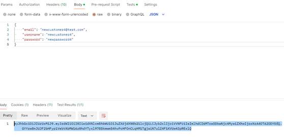
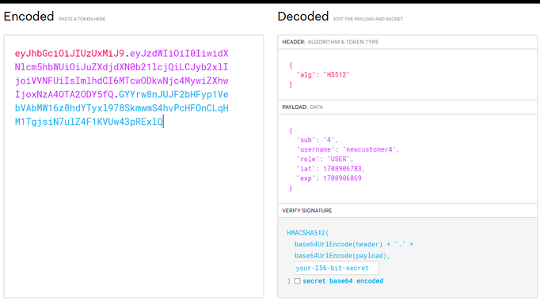
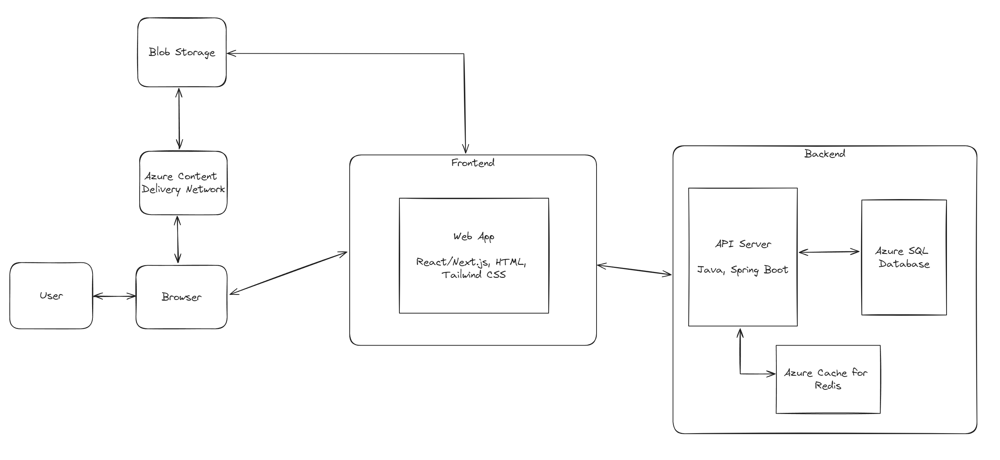
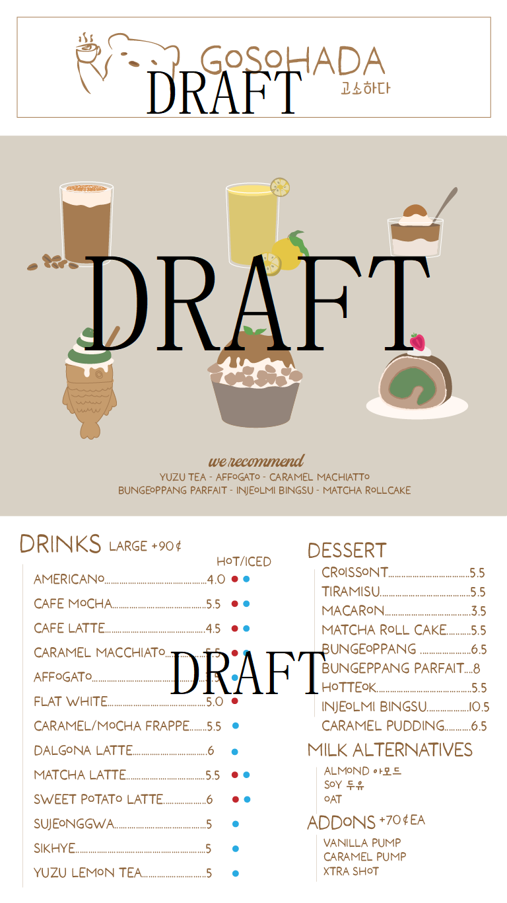
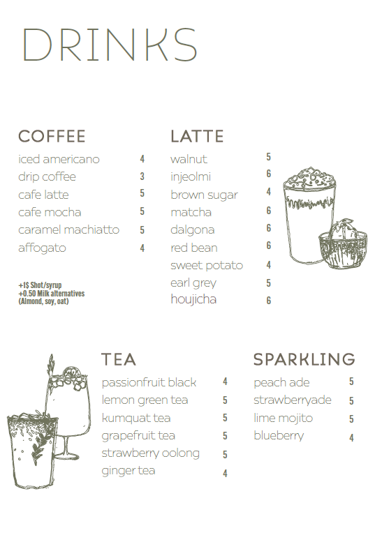
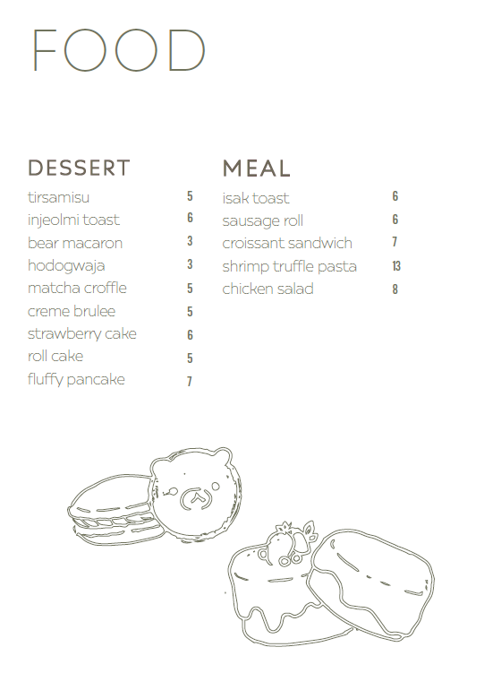
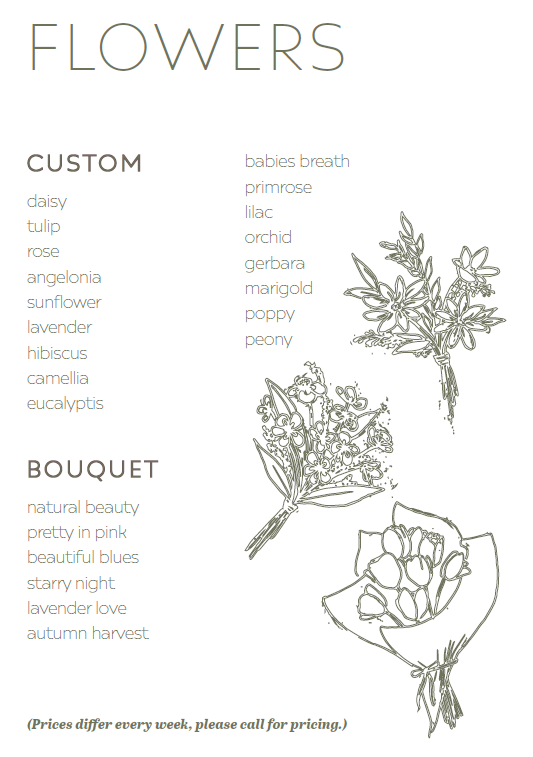

# Azure Cafe Application

## Description

Welcome to our cozy cafe! Customers can explore a variety of food items, drinks, and even flowers available for ordering. Customers looking to study or work at a cafe may find that many of them are fully packed or have a long wait time after ordering in-person. To improve their experience, users can order online and make seat reservations at the cafe!

### Notable Features
- Authentication and authorization using JSON Web Tokens (JWTs), Spring Security, and BCrypt (Hash + Salt)
- Reliable and fast cloud-hosted database using Azure SQL Database with a cost-effective DTU-based model
- Cart is handled on the server instead of just in the browser
- Focus on Object Oriented Programming and SOLID principles
- SwaggerUI API docs

## Technologies

- **Frontend:**  Next.js, TypeScript, and Tailwind CSS.

- **Backend:** Java and Spring Boot were used to build a robust and scalable RESTful APIs. Within the server, I used JWTs, Spring Security, and BCrypt to implement a secure application. Used Swagger UI to create a visual and interactive REST API documentation to allow for end-user viewing.

- **Database:** The application utilizes Microsoft Azure SQL Database to store information relating the the user, product, orders, and reservations.

- **Cloud Services:** Utilized Azure Blob Storage and Azure Content Delivery Network (CDN) to optimize the caching and global delivery of low-latency content at scale

## Live Demo

Frontend (*work-in-progress*): azure-cafe-app.vercel.app/

Backend API Server (Swagger UI): https://azure-cafe-app-production.up.railway.app/swagger-ui/ 
- If it asks for credentials when visiting the site, use: `newcustomer1` and `newpassword1`
- This project is a work-in-progress, so the server may be unresponsive at times

## Lessons Learned / Challenges

### 1. Salting/hashing, Spring Security, and JWT

[System Design: How to store passwords in a database?](https://www.youtube.com/watch?v=zt8Cocdy15c) and [Password Storage Tier List](https://www.youtube.com/watch?v=qgpsIBLvrGY) taught me best practices on how to storage passwords in a database. The videos recommended that passwords be both hashed and salted to prevent dictionary attacks and usage of rainbow tables. Salting a password generates unique hashes for every input by prepending/appending a salt prior to hashing. However, modern technology allows for billions of computations per second; to combat this, we can use Slow Hashing with Password Hash Algorithms such as BCrypt, Scrypt, or Argon2 which deliberately run slowly.

I wanted to implement authentication and authorization using Spring Security. A primary challenge was trying to find up-to-date information due to the many changes in Spring Security. One of the notable ones was the [deprecation of WebSecurityConfigurerAdapter](https://spring.io/blog/2022/02/21/spring-security-without-the-websecurityconfigureradapter). This caused numerous errors and some confusion as many online examples used syntax that extended WebSecurityConfigurerAdapter, which was not applicable to my code.

JSON Web Token (JWT) is an internet standard for securely transmitting information between parties. Implementing this feature was challenging due to the technical nature of this material, as well as many of the example code extends WebSecurityConfigurerAdapter as mentioned above. Despite that, following the [sample code](https://github.com/murraco/spring-boot-jwt/blob/master/src/main/java/murraco/security/JwtTokenProvider.java) gave sufficient background information to use in my own project. The key part was having a JwtTokenProvider class to handle creating and validating the token, then a JwtTokenFilter class to use in [SecurityFilterChain](https://docs.spring.io/spring-security/reference/servlet/configuration/java.html). JWT is applied by calling .addFilterBefore() on HttpSecurity. I also needed to refactor my code to implement UserDetailsService and change my User class to have authorities that work with the role-based authentication.





### 2. Architecting Classes and Inheritance

Designing the class architecture was a great learning experience to apply SOLID principles. For example, I created an abstract Product class, which was extended by Food, Drink, and Merchandise. One challenge was creating the entire server-based Cart and Order system, especially with the Drinks having different options and a map to handle the add-ons. The DrinkCartItem contains a map of how many add-ons (ex. Pearls, Jelly, etc) the customer chose, while the Drink product contains a map of the price of the add-on (ex. Pearl for $0.5 extra). When placing an order, I created a new OrderItem for every CartItem, and emptied the contents of the cart.

### 3. Database

I tested the Azure SQL Database using the free tier (100,000 vCore seconds/month) for the vCore purchasing model. The database would pause on lack of activity, which is useful for saving costs in a serverless environment. However, the 'cold boot'/auto-resuming of the database would take over 20 seconds. Having the server up 24/7 would result in over $400/month of costs. In the end, I went with a significantly cheaper DTU-based model at $5/month which has constant uptime.

## System Architecture

Exploring how I would potentially scale this project up led me to resources on Microsoft docs such as [Architect scalable e-commerce web app](https://learn.microsoft.com/en-us/azure/architecture/web-apps/idea/scalable-ecommerce-web-app).

Using those references, I researched and designed the following system design. Key upgrades compared to my current application includes a CDN to pull images from a Blob Storage, and a Redis cache for frequently accessed data such as Product searching. Other improvements could be a Load Balancer and Azure Functions to handle payment.



The application currently uses Azure Blob Storage and Azure Content Delivery Network (CDN) to optimize content delivery.

## Design Concept

 |  

 | 

## How to Run Locally

- Set up a database (ex. Azure SQL Datbase)

- Fill in and utilize the following environment variables (ex. create `env.sh` -> type `source env.sh`):
```
AZ_SERVER_NAME=
AZ_DATABASE_NAME=

DATABASE_USERNAME=
DATABASE_PASSWORD=

JWT_SECRET=
JWT_EXPIRATION=
```

- Run the Spring Boot application
```
./mvnw spring-boot:run
```